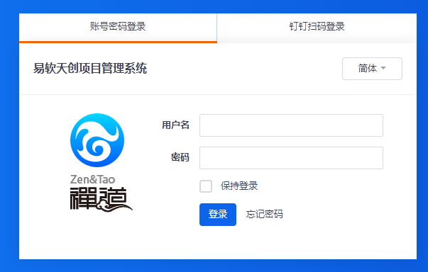
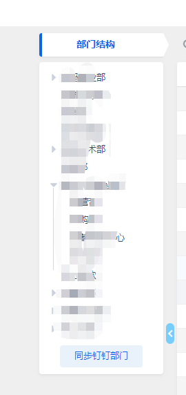
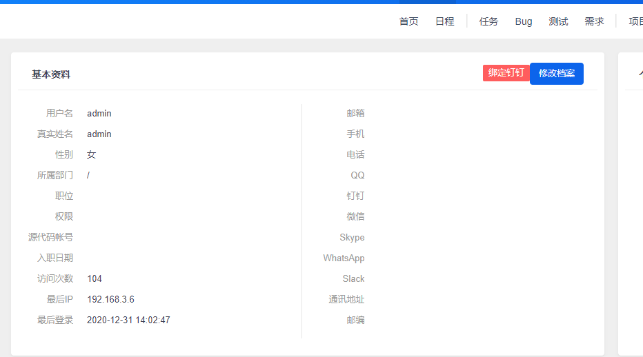

## 功能说明：为禅道开源码版12.4.3 添加钉钉第三方登录插件。
### 使用方式：导入数据库文件，然后将文件直接复制覆盖到禅道源码版里并即可，如果版本原因不能使用，请按第四点方法更改代码。注意复盖前请备份好环境代码。
### 原改改动：钉钉注册及登录方式设置,在my.php里的logintype参数可以设置为【0仅允许绑定过钉钉的账号扫码登录, 1允许钉钉扫码注册并登录(原版模式,推荐新平台搭建注册人员使用方便)】
### 最新改动：增加了同步钉钉部门信息，同时禁止外部员工登录。

### 钉钉配置说明
钉钉上需要开通2个应用 ，首先需要拿到钉钉管理员账号，登入到https://open-dev.dingtalk.com

## 创建H5微应用
应用开发-》H5微应用-》创建应用，应用类型选择H5微应用，填应用名称和应用描述，开发方式选择企业自助开发。创建好后记录下AppKey和AppSecret，供my.php配置参数使用。
进入刚创建的H5微应用-》开发管理-》服务器出口IP填写禅道公网出口IP，服务器查询公网IP自己百度，应用首页地址填禅道部署访问域名或者IP

## 创建扫码登录
应用开发-》登录-》创建扫码登录应用受权
名称，描述随便填，授权LOGO地址和调域名直接填禅道部署访问域名或者IP。

### 安装说明：

#### 一、数据库更改：
* 数据库执行zentao_dt_mysql.sql文件，为数据库用户表zt_user添加钉钉用户数据字段


#### 二、模块增加：
* 将/module/dingtalk/ 下的文件复制到 禅道的/module/dingtalk/目录下,如果目录不存在则新建


#### 三、配置增加：
* /config/filter.php 最后两行增加了dingtalk模块的参数过滤
```
/* 钉钉登录GET参数 */
$filter->dingtalk->login->get['code'] = 'reg::any';
$filter->dingtalk->login->get['state'] = 'reg::any';
```
* /config/my.php 最后增加了钉钉参数配置, 请将配置里的钉钉参数修改为你的钉钉参数
```
/* 钉钉登录配置 */
$config->ding->ddturnon = true;/* 是否开启钉钉登录 */
$config->ding->logintype = 1;/* 钉钉登录方式,0仅允许绑定登录,1允许自动注册登录(建议新平台使用此方法,方便人员自行添加) */
$config->ding->appid = '';/* 钉钉扫码登录appId */
$config->ding->appsecret = '';/* 钉钉扫码登录appSecret */
$config->ding->redirect = '';/* 回调地址域名,与钉钉管理后台保持一致 */
$config->ding->inter_appkey = '';/* 钉钉H5微应用appkey */
$config->ding->inter_appsecret = '';/* 钉钉H5微应用AppSecret */
```

#### 四、文件更改：
复制文件之前推荐先备份目录下所有文件，如果复制过去不能使用，安以下方法更更源代码

* /module/user/view/login.html.php 先找到以下三行代码
```
<main id="main" class="fade no-padding">
  <div class="container" id="login">
    <div id="loginPanel">
```
替换成如下代码
```
<script src="https://g.alicdn.com/dingding/dinglogin/0.0.5/ddLogin.js"></script>
<script>
window.onload = function(){
<?php
echo "var appid='".$config->ding->appid."';";
echo "var state='".$this->loadModel('dingtalk')->updateSessionDing()."';";
echo "var redirect_uri='".$config->ding->redirect.$this->createLink('dingtalk','login')."';";
?>
  /*
  * 解释一下goto参数，参考以下例子：
  * var url = encodeURIComponent('http://localhost.me/index.php?test=1&aa=2');
  * var goto = encodeURIComponent('https://oapi.dingtalk.com/connect/oauth2/sns_authorize?appid=appid&response_type=code&scope=snsapi_login&state=STATE&redirect_uri='+url)
  */
  var url = encodeURIComponent(redirect_uri);
  var goto_url = 'https://oapi.dingtalk.com/connect/oauth2/sns_authorize?appid='+appid+'&response_type=code&scope=snsapi_login&state='+state+'&redirect_uri='+url;
  var goto = encodeURIComponent(goto_url)
  var obj = DDLogin({
      id:"login_scan",//这里需要你在自己的页面定义一个HTML标签并设置id，例如<div id="login_container"></div>或<span id="login_container"></span>
      goto: goto, //请参考注释里的方式
      style: "border:none;background-color:#FFFFFF;",
      width : "560",
      height: "300"
  });

  var handleMessage = function (event) {
  var origin = event.origin;
  console.log("origin", event.origin);
  if( origin == "https://login.dingtalk.com" ) { //判断是否来自ddLogin扫码事件。
    var loginTmpCode = event.data; 
    //获取到loginTmpCode后就可以在这里构造跳转链接进行跳转了
    window.location.replace(goto_url+'&loginTmpCode='+loginTmpCode);
    console.log("url", goto_url+'&loginTmpCode='+loginTmpCode);
    }
  };
  if (typeof window.addEventListener != 'undefined') {
      window.addEventListener('message', handleMessage, false);
  } else if (typeof window.attachEvent != 'undefined') {
      window.attachEvent('onmessage', handleMessage);
  }
}
function scan_onclick(val){
  login_scan.hidden=!val;
  loginPanel.hidden=val;
  document.getElementById('label_scan').className = val?"select":"unselect";
  document.getElementById('lable_pwd').className = val?"unselect":"select";
}
</script>
<style>
  .unselect{
            cursor: pointer;
            text-align: center;
            background: #FFFFFF;
            border-bottom:3px solid #FFFFFF;
            height:40px;
  }
  .select{
            cursor: pointer;
            text-align: center;
            background: #FFFFFF;
            border-bottom:3px solid #ff6a00;
            height:40px;
  }
</style>
<main id="main" class="fade no-padding">
  <div class="container" id="login">
    <table width="560px">
      <row>
        <td id="lable_pwd" onclick="scan_onclick(false);" class="select">账号密码登录</td>
        <td id="label_scan" onclick="scan_onclick(true);" class="unselect" style="border-left:1px solid #b3d4fc;">钉钉扫码登录</td>
      </row>
    </table>
    <div id="login_scan" hidden="true" style="border:none;background-color:#FFFFFF;height:305px;width:560px;"></div>
    <div id="loginPanel" style="border:none;background-color:#FFFFFF;height:305px;width:560px;border-radius: 0px;">
```
* /module/my/view/profile.html.php 增加了绑定钉钉按钮的1行代码,在代码```echo html::a($this->createLink('my', 'editprofile'), $lang->user->editProfile, '', "class='btn btn-primary'");```增加以下代码
```
/* 钉钉绑定按钮 */ if($config->ding->ddturnon) echo html::linkButton($lang->user->dingBindBtn,"https://oapi.dingtalk.com/connect/qrconnect?appid=".$config->ding->appid."&response_type=code&scope=snsapi_login&state=".$this->loadModel('dingtalk')->updateSessionDing()."&redirect_uri=".urlencode($config->ding->redirect.$this->createLink('dingtalk','login')),'window','','btn-danger');
```
* /module/my/view/changepassword.html.php 增加了提示初始密码为123456的1行代码,把代码```echo html::password('originalPassword', '', "class='form-control'");```代码替换成如下代码
```
/* 钉钉绑定按钮 */ echo html::password('originalPassword', '', "class='form-control' placeholder='初始密码 123456'");
```
* /module/user/lang/ 下的语言包文件添加了钉钉按钮文字显示内容 $lang->user->dingBtn 和 $lang->user->dingid
```
$lang->user->dingid = "钉钉ID";
$lang->user->dingBtn = "钉钉登录";
$lang->user->dingBindBtn = "绑定钉钉";

$lang->user->dingid = '釘釘ID';
$lang->user->dingBtn = '釘釘登錄';
$lang->user->dingBtn = '綁定釘釘';

$lang->user->dingid = 'DingTalk ID';
$lang->user->dingBtn = 'DingTalk Login';
$lang->user->dingBtn = 'Bind DingTalk';
```
* /module/common/model.php 里的isOpenMethod方法添加钉钉登录开放,方法第一行增加以下代码
```
if($module == 'dingtalk' and $method == 'login')  return true;
```
* /module/dept/lang 下的语言包文件添加了同步同步钉钉组织结构按钮文字显示内容
```
$lang->dept->syncding = '同步钉钉部门';
$lang->dept->syncding = '同步釘釘部門';
$lang->dept->syncding = 'Synchronous Dingding Department';
```
* /module/company/view/browse.html.php 把维护部门换成同步钉钉同步部门,把代码```common::printLink('dept', 'browse', '', $lang->dept->manage, '', "class='btn btn-info btn-wide'");```替换成以下代码
```
/* 同步钉钉部门 */ common::printLink('dingtalk', 'syncdept', '', $lang->dept->syncding, '', "class='btn btn-info btn-wide'");
```


效果图如下




